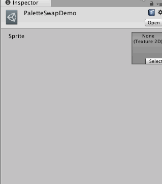
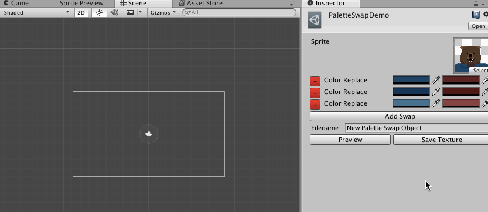

# PaletteSwapper

PaletteSwapper is a small tool for image color manipulation in Unity.  I made PaletteSwapper in a fairly short amount of time to solve some context-switching slowdowns in my own personal Game Jam process.

If you find yourself working primarily in Unity but still aiming to do some minor color tweaks on low-fidelity artwork, this tool might help you as well.  For people making their own tools, it also presents a fairly basic starting point for loading, manipulating and exporting png files from the Unity Editor.

## Usage

Click _Tools -> New PaletteSwap_ to create a palette swap object.  The inspector window for these objects provide the interface for modifying and exporting your new sprite assets.  The object themselves can be kept around for future exports - it saves you the time of resampling all the colors in the image.

You can assign a texture2D to the object.  Note that any texture assigned will have it's import settings _Read/Write_ flag set to true, so we can read the pixels.

Click _Preview_ right off the bat to get a basic preview window showing.  you can throw this wherever you like - I usually replace the game scene. you can use this preview to sample colors for the swaps.

Click _Add Swap_ to add a Palette Swap command to the queue of commands.  The first color is the target color - you typically want to use the eyedropper tool to grab this from thepreview image.  Currently, the tool ignores alpha for the sake of my workflow.  You can select anything you like for the second color.  When you click _Preview_ , the Sprite preview window will update showing the altered sprite, which you can then Save with _Save Texture_.  That's it!